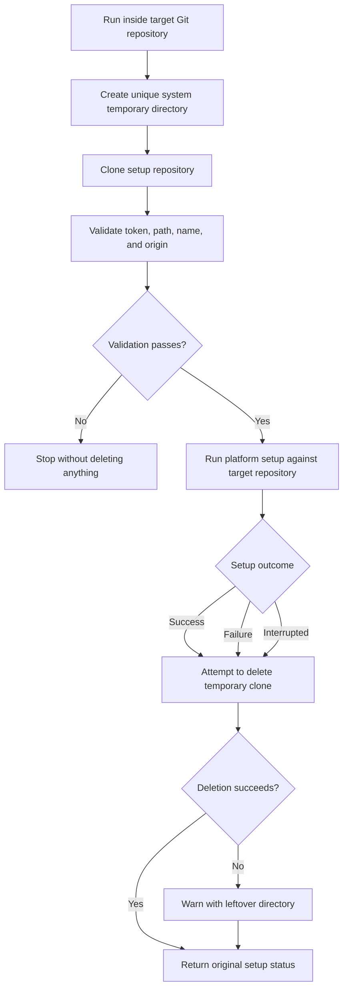

# GitHub Personal Setup

Configure a local Git repository to use a personal GitHub account without pasting a password, personal access token, or private SSH key into a script.

The project provides separate native setup scripts for:

- macOS
- Linux
- Windows PowerShell

Each script creates or reuses an account-specific SSH key, configures an SSH host alias, verifies GitHub authentication, and applies the selected identity and remote to the current repository only.

## Before You Start

You need:

1. An existing GitHub account.
2. An existing empty or populated repository under that account.
3. A local Git repository created with `git init` or cloned from elsewhere.
4. Git and OpenSSH installed.

[GitHub CLI](https://cli.github.com/) is optional but recommended. When available, the setup command selects the requested GitHub account or opens GitHub's official browser login, creates the SSH key, and uploads its public half automatically. You do not need to run `gh auth` commands or paste a key before setup. The scripts never receive the resulting credential.

When `ssh-keygen` creates a key, it asks for an optional passphrase. Entering a passphrase protects the private key if the file is copied; pressing Enter twice creates the key without one. The passphrase prompt belongs directly to `ssh-keygen`, not these scripts.

### Automatic And Manual Authentication

The recommended run-once command is the only command needed when GitHub CLI is installed:

1. Enter the GitHub username, commit identity, and existing repository URL when prompted.
2. Review the repository, personal account, identity, and new remote, then confirm the personal setup. Declining stops before GitHub CLI, SSH, or Git configuration is changed.
3. Setup temporarily selects that GitHub CLI account. If it is not already available, a browser opens so you can sign in as that account.
4. Setup creates an account-specific SSH key and asks for its optional passphrase.
5. GitHub CLI uploads only the public key. Nothing needs to be copied or pasted.
6. Setup restores whichever GitHub CLI account was active before setup.
7. Setup verifies SSH, then configures the current repository.

To avoid GitHub CLI, add `--manual` on macOS/Linux or `-Manual` on Windows. In manual mode, setup creates the key, copies the public key to the clipboard when possible, and opens [GitHub's new SSH key page](https://github.com/settings/ssh/new). Paste it into the **Key** field, enter any descriptive title, select **Add SSH key**, then return to the terminal and press Enter. Never paste the private key, whose filename does not end in `.pub`.

If GitHub CLI is not installed, setup uses this manual flow automatically.

## Run Once (Recommended)

The target GitHub repository must already exist. These scripts do not create repositories, commit files, or push code.

The run-once commands clone this project into a uniquely named system temporary directory. The runner and its outer wrapper both attempt to remove that clone after setup succeeds, fails, or is interrupted. If the operating system prevents deletion, a warning identifies the leftover directory without overwriting the setup result. The local repository being configured and the SSH/Git settings created by setup are never deleted.



### macOS Or Linux

Open a terminal in the local repository you want to configure, then run:

```bash
git rev-parse --show-toplevel >/dev/null && (
  set -e
  setup_dir="$(mktemp -d "${TMPDIR:-/tmp}/github-personal-setup.XXXXXX")"
  cleanup_setup_dir() {
    exit_code=$?
    trap - EXIT HUP INT TERM
    if [[ -d "$setup_dir" ]] && ! rm -rf -- "$setup_dir"; then
      printf 'Warning: Could not remove temporary setup clone: %s\n' "$setup_dir" >&2
    fi
    exit "$exit_code"
  }
  trap cleanup_setup_dir EXIT
  trap 'exit 129' HUP
  trap 'exit 130' INT
  trap 'exit 143' TERM
  git clone --depth 1 https://github.com/protiktoken/github-personal-setup.git "$setup_dir"
  GITHUB_PERSONAL_SETUP_TEMP_ROOT="$setup_dir" bash "$setup_dir/bootstrap/run.sh"
)
```

The runner selects macOS or Linux automatically. Add setup options after `run.sh`, for example `--manual` to register the public SSH key yourself.

The macOS setup uses `pbcopy` and `open` for manual registration and enables Apple's Keychain integration. Linux uses `wl-copy` or `xclip` when available and opens GitHub with `xdg-open`.

### Windows PowerShell

Open PowerShell in the local repository you want to configure, then run:

```powershell
$powerShellExecutable = (Get-Process -Id $PID).Path
& $powerShellExecutable -NoProfile -ExecutionPolicy Bypass -Command {
  git rev-parse --show-toplevel *> $null
  if ($LASTEXITCODE -ne 0) {
    [Console]::Error.WriteLine('Run this inside the Git repository you want to configure.')
    exit 1
  }

  $setupDir = Join-Path ([System.IO.Path]::GetTempPath()) ("github-personal-setup-{0}" -f [guid]::NewGuid())
  $setupExitCode = 1
  try {
    git clone --depth 1 https://github.com/protiktoken/github-personal-setup.git $setupDir
    $setupExitCode = $LASTEXITCODE

    if ($setupExitCode -eq 0) {
      $env:GITHUB_PERSONAL_SETUP_TEMP_ROOT = $setupDir
      $runnerPowerShell = (Get-Process -Id $PID).Path
      & $runnerPowerShell -NoProfile -ExecutionPolicy Bypass -File "$setupDir\bootstrap\run.ps1"
      $setupExitCode = $LASTEXITCODE
    }
  }
  finally {
    Remove-Item Env:GITHUB_PERSONAL_SETUP_TEMP_ROOT -ErrorAction SilentlyContinue
    if (Test-Path -LiteralPath $setupDir) {
      try {
        Remove-Item -LiteralPath $setupDir -Recurse -Force
      }
      catch {
        Write-Warning "Could not remove temporary setup clone: $setupDir"
      }
    }
  }

  if ($setupExitCode -ne 0) {
    [Console]::Error.WriteLine("Setup failed with exit code $setupExitCode.")
  }
  exit $setupExitCode
}
```

Add setup options after `run.ps1`, for example `-Manual`. Windows uses `Set-Clipboard` and opens the GitHub SSH-key page for manual registration.

## Keep A Reusable Copy (Optional)

Contributors or users configuring many repositories can keep one clone instead:

```bash
git clone https://github.com/protiktoken/github-personal-setup.git
```

Run the relevant platform script from inside the repository you want to configure:

```bash
bash /path/to/github-personal-setup/macos/setup.sh
bash /path/to/github-personal-setup/linux/setup.sh
```

```powershell
powershell -ExecutionPolicy Bypass -File C:\path\to\github-personal-setup\windows\setup.ps1
```

Manual clones are never deleted automatically.

## Questions The Scripts Ask

Every script asks for:

- GitHub username
- Git commit author name
- Git commit author email
- Existing GitHub repository HTTPS or SSH URL

Accepted repository URL examples:

```text
https://github.com/username/repository.git
git@github.com:username/repository.git
ssh://git@github.com/username/repository.git
```

The supplied username selects the personal SSH identity. The URL owner selects the repository path, so it can be your username, an organization, or another user who has granted you collaborator access. The saved remote is normalized to an account-specific SSH alias while preserving the URL owner:

```text
git@github-personal-username:repository-owner/repository.git
```

For example, personal user `octocat` collaborating on `hubot/example` gets:

```text
git@github-octocat:hubot/example.git
```

The alias username is generated from the personal GitHub username entered by each user; it is not a fixed project account. Only repositories whose remote uses that generated alias use the personal key. Repositories that keep their normal `github.com` remote continue using the machine's existing default GitHub configuration. GitHub enforces whether that personal account has permission to access the repository.

This allows personal and work GitHub accounts to coexist without changing the machine's default Git identity or active GitHub CLI account. GitHub Copilot authentication is separate and is never inspected or changed by these scripts.

## Non-Interactive Arguments

The same values can be supplied as command-line arguments.

macOS or Linux:

```bash
bash setup.sh \
  --username octocat \
  --name "The Octocat" \
  --email octocat@users.noreply.github.com \
  --repo-url https://github.com/octocat/example.git
```

Windows PowerShell:

```powershell
.\setup.ps1 `
  -GitHubUsername octocat `
  -CommitName 'The Octocat' `
  -CommitEmail octocat@users.noreply.github.com `
  -RepositoryUrl https://github.com/octocat/example.git
```

Use `--yes` on macOS/Linux or `-Yes` on Windows only for automation where you explicitly consent to configuring the current repository for the supplied personal account without the confirmation prompt. It also permits replacing a different existing `origin`.

Use `--manual` on macOS/Linux or `-Manual` on Windows to skip GitHub CLI and register the displayed public key through GitHub settings yourself.

## What Changes

The scripts may create:

```text
~/.ssh/id_ed25519_github_<username>
~/.ssh/id_ed25519_github_<username>.pub
```

They maintain a clearly marked account block in `~/.ssh/config`:

```text
# >>> github-personal-setup:github-<username> >>>
Host github-<username>
  HostName github.com
  User git
  IdentityFile "..."
  IdentitiesOnly yes
# <<< github-personal-setup:github-<username> <<<
```

Inside the current repository, they set:

```text
user.name
user.email
remote.origin.url
```

They do not change the global Git author identity.

## Security Model

- Never paste a GitHub password, personal access token, SSH passphrase, or private key into these scripts.
- A passphrase is entered directly into `ssh-keygen`, which owns that prompt.
- GitHub CLI authentication happens through GitHub's official browser/device flow.
- The previously active GitHub CLI account is restored after automatic public-key registration.
- GitHub Copilot authentication is not read or changed.
- Only the public key (`.pub`) is uploaded or shown for manual registration.
- A different existing `origin` requires confirmation before replacement.
- Repository identity and remote changes happen only after SSH authentication succeeds.
- Existing SSH configuration is preserved. Each account is maintained inside its own clearly marked block.
- The first SSH verification uses `StrictHostKeyChecking=accept-new`, which accepts and records a previously unseen GitHub host key but rejects a changed key.

Review scripts before running them, especially when using setup automation obtained from someone else.

## After Setup

If the local repository has no commit yet:

```bash
git add .
git commit -m "Initial commit"
git push -u origin main
```

For an existing branch, use the branch-specific push command printed by the script.

Verify the configuration at any time:

```bash
git config --local user.name
git config --local user.email
git remote -v
ssh -T git@github-<username>
```

GitHub's successful SSH test normally exits with status `1` while printing "successfully authenticated" because GitHub does not provide shell access.

## Troubleshooting

### GitHub CLI Is Using The Wrong Account

Rerun the setup command and enter the intended GitHub username. Setup tries to select that account before creating an SSH key and opens browser login when the account is not yet available to GitHub CLI.

If login was cancelled, rerunning is safe. Existing complete account-specific keys are reused, and repository identity and remote settings are not applied until SSH authentication succeeds. Use `gh auth status --hostname github.com` only when you need to inspect GitHub CLI's stored accounts directly.

### Repository Not Found

Confirm that the GitHub repository already exists at the supplied URL and that the personal account owns it, belongs to its organization, or has been added as a collaborator.

### SSH Authentication Fails

Confirm that the public key shown by the script appears under [GitHub SSH keys](https://github.com/settings/keys), then rerun:

```bash
ssh -vT git@github-<username>
```

The verbose output shows which key SSH attempted to use.

### Corporate Network Blocks SSH

Some managed networks block outbound SSH on port 22. Try another network or ask the network administrator whether GitHub SSH access is permitted. Do not disable TLS or SSH verification as a workaround.

## Tests

On macOS or Linux:

```bash
bash tests/run.sh
```

On Windows PowerShell:

```powershell
.\tests\test-windows.ps1
```

Tests use temporary homes, fake SSH keys, and stubbed GitHub commands. They do not access a real GitHub account or modify the user's SSH configuration.