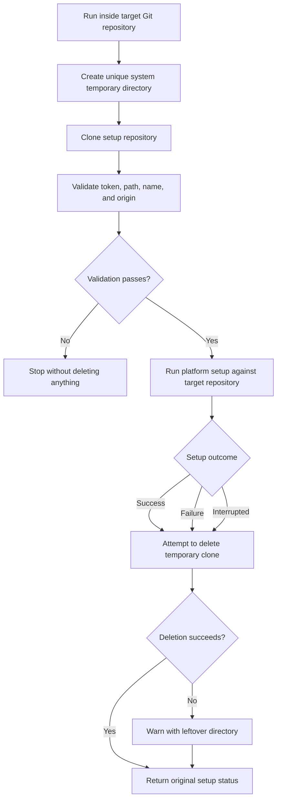

# GitHub Personal Setup

Configure one local Git repository to use a personal GitHub account without changing the machine's default work account or GitHub Copilot login. Native scripts support macOS, Linux, and Windows PowerShell.

Setup creates or reuses a personal SSH key, verifies it with GitHub, and configures the current repository's author and `origin`. It never asks for a password, token, or private key.

## Before You Start

You need:

1. Git and OpenSSH.
2. A personal GitHub account.
3. An existing local Git repository.
4. An existing GitHub repository you can access. It may belong to you, an organization, or someone who added you as a collaborator.

[GitHub CLI](https://cli.github.com/) is optional but recommended. Without it, setup guides you through adding the public SSH key manually.

## What You Do

1. Open a terminal in the local repository you want to configure.
2. Run the command for your operating system below.
3. Enter your personal GitHub username, commit name, commit email, and the existing GitHub repository URL.
4. Review the summary, especially the repository owner and new remote, then confirm. Declining stops before anything changes.
5. If `ssh-keygen` asks for a passphrase, choose one or press Enter twice for no passphrase.
6. If a GitHub browser login opens, sign in with the personal account you entered.
7. After setup succeeds, run the printed `git push` command.

With GitHub CLI, setup temporarily selects the personal account, uploads only the public key, and restores the previously active account. Without GitHub CLI, it opens [GitHub's new SSH key page](https://github.com/settings/ssh/new) and copies the public key when possible. Paste it into **Key**, enter a title, select **Add SSH key**, return to the terminal, and press Enter. Never paste the private key, whose filename does not end in `.pub`.

## Run Once (Recommended)

The GitHub repository must already exist. Setup does not create repositories, commit files, or push code. These commands use a temporary clone of this project and remove it afterward; cleanup never deletes the repository being configured or its SSH/Git settings.



### macOS Or Linux

Open a terminal in the local repository you want to configure, then run:

```bash
git rev-parse --show-toplevel >/dev/null && (
  set -e
  setup_dir="$(mktemp -d "${TMPDIR:-/tmp}/github-personal-setup.XXXXXX")"
  cleanup_setup_dir() {
    exit_code=$?
    trap - EXIT HUP INT TERM
    if [[ -d "$setup_dir" ]] && ! rm -rf -- "$setup_dir"; then
      printf 'Warning: Could not remove temporary setup clone: %s\n' "$setup_dir" >&2
    fi
    exit "$exit_code"
  }
  trap cleanup_setup_dir EXIT
  trap 'exit 129' HUP
  trap 'exit 130' INT
  trap 'exit 143' TERM
  git clone --depth 1 https://github.com/protiktoken/github-personal-setup.git "$setup_dir"
  GITHUB_PERSONAL_SETUP_TEMP_ROOT="$setup_dir" bash "$setup_dir/bootstrap/run.sh"
)
```

The runner selects macOS or Linux automatically.

### Windows PowerShell

Open PowerShell in the local repository you want to configure, then run:

```powershell
$powerShellExecutable = (Get-Process -Id $PID).Path
& $powerShellExecutable -NoProfile -ExecutionPolicy Bypass -Command {
  git rev-parse --show-toplevel *> $null
  if ($LASTEXITCODE -ne 0) {
    [Console]::Error.WriteLine('Run this inside the Git repository you want to configure.')
    exit 1
  }

  $setupDir = Join-Path ([System.IO.Path]::GetTempPath()) ("github-personal-setup-{0}" -f [guid]::NewGuid())
  $setupExitCode = 1
  try {
    git clone --depth 1 https://github.com/protiktoken/github-personal-setup.git $setupDir
    $setupExitCode = $LASTEXITCODE

    if ($setupExitCode -eq 0) {
      $env:GITHUB_PERSONAL_SETUP_TEMP_ROOT = $setupDir
      $runnerPowerShell = (Get-Process -Id $PID).Path
      & $runnerPowerShell -NoProfile -ExecutionPolicy Bypass -File "$setupDir\bootstrap\run.ps1"
      $setupExitCode = $LASTEXITCODE
    }
  }
  finally {
    Remove-Item Env:GITHUB_PERSONAL_SETUP_TEMP_ROOT -ErrorAction SilentlyContinue
    if (Test-Path -LiteralPath $setupDir) {
      try {
        Remove-Item -LiteralPath $setupDir -Recurse -Force
      }
      catch {
        Write-Warning "Could not remove temporary setup clone: $setupDir"
      }
    }
  }

  if ($setupExitCode -ne 0) {
    [Console]::Error.WriteLine("Setup failed with exit code $setupExitCode.")
  }
  exit $setupExitCode
}
```

## Accounts, Owners, And Remotes

Setup asks for four values:

- **Personal GitHub username:** selects the personal account and SSH key.
- **Commit name and email:** set the author identity only in the current repository.
- **Repository URL:** identifies the existing repository to use.

Accepted URL formats include:

```text
https://github.com/owner/repository.git
git@github.com:owner/repository.git
ssh://git@github.com/owner/repository.git
```

The URL owner may be your username, an organization, or another user who granted you collaborator access. Setup preserves that owner while routing SSH through your personal key:

```text
git@github-personal-username:repository-owner/repository.git
```

For example, personal user `octocat` collaborating on `hubot/example` gets:

```text
git@github-octocat:hubot/example.git
```

Only remotes using `github-<personal-username>` use the personal key. Normal `github.com` remotes continue using the machine's default GitHub configuration. GitHub still enforces repository permissions.

## Options

- `--manual` on macOS/Linux or `-Manual` on Windows skips GitHub CLI and guides you through adding the public key manually.
- `--yes` on macOS/Linux or `-Yes` on Windows skips confirmation for automation and permits replacing a different `origin`.

Example with all values supplied:

```bash
bash setup.sh \
  --username octocat \
  --name "The Octocat" \
  --email octocat@users.noreply.github.com \
  --repo-url https://github.com/hubot/example.git
```

```powershell
.\setup.ps1 `
  -GitHubUsername octocat `
  -CommitName 'The Octocat' `
  -CommitEmail octocat@users.noreply.github.com `
  -RepositoryUrl https://github.com/hubot/example.git
```

## What Changes

Setup may create an account-specific key pair and a clearly marked block in `~/.ssh/config`:

```text
~/.ssh/id_ed25519_github_<username>
~/.ssh/id_ed25519_github_<username>.pub

# >>> github-personal-setup:github-<username> >>>
Host github-<username>
  HostName github.com
  User git
  IdentityFile "..."
  IdentitiesOnly yes
# <<< github-personal-setup:github-<username> <<<
```

In the current repository, it sets `user.name`, `user.email`, and `remote.origin.url`.

Setup does **not** change:

- Global Git author settings.
- Other repositories or their remotes.
- The machine's default GitHub SSH identity.
- GitHub Copilot authentication.
- The GitHub CLI account that was active before setup.

Existing SSH configuration is preserved. A different `origin` requires confirmation, and repository settings are applied only after SSH authentication succeeds.

## Keep A Reusable Copy (Optional)

To configure many repositories, clone this project once:

```bash
git clone https://github.com/protiktoken/github-personal-setup.git
```

From the repository you want to configure, run the relevant script:

```bash
bash /path/to/github-personal-setup/macos/setup.sh
bash /path/to/github-personal-setup/linux/setup.sh
```

```powershell
powershell -ExecutionPolicy Bypass -File C:\path\to\github-personal-setup\windows\setup.ps1
```

Manual clones are never deleted automatically.

## After Setup

Use the push command printed by setup. For a new repository, this is typically:

```bash
git add .
git commit -m "Initial commit"
git push -u origin main
```

Verify the configuration at any time:

```bash
git config --local user.name
git config --local user.email
git remote -v
ssh -T git@github-<username>
```

GitHub's successful SSH test normally exits with status `1` while printing "successfully authenticated" because GitHub does not provide shell access.

## Troubleshooting

### GitHub CLI Is Using The Wrong Account

Rerun setup with the intended personal username. Setup selects that account before creating the key and restores the previously active account afterward. If the account is unavailable, GitHub CLI opens browser login.

### Repository Not Found

Confirm that the repository exists at the supplied URL and that the personal account owns it, belongs to its organization, or has collaborator access.

### SSH Authentication Fails

Confirm that the public key appears under [GitHub SSH keys](https://github.com/settings/keys), then run:

```bash
ssh -vT git@github-<username>
```

### Corporate Network Blocks SSH

Some managed networks block SSH on port 22. Try another network or ask the network administrator whether GitHub SSH is permitted. Do not disable TLS or SSH verification.

## Tests

```bash
bash tests/run.sh
```

```powershell
.\tests\test-windows.ps1
```

Tests use temporary homes, fake SSH keys, and stubbed GitHub commands. They do not access a real GitHub account or modify the user's SSH configuration.
